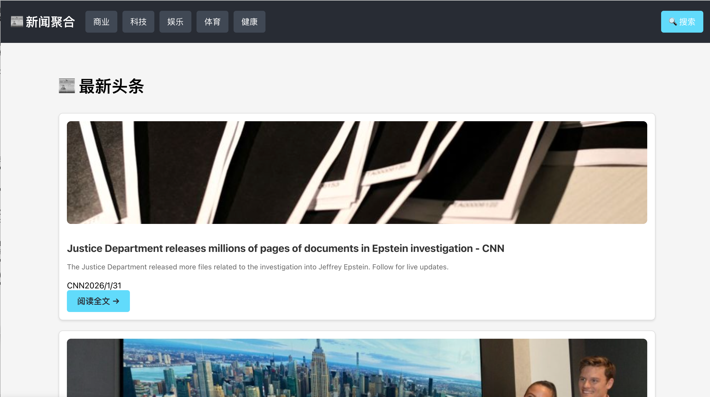
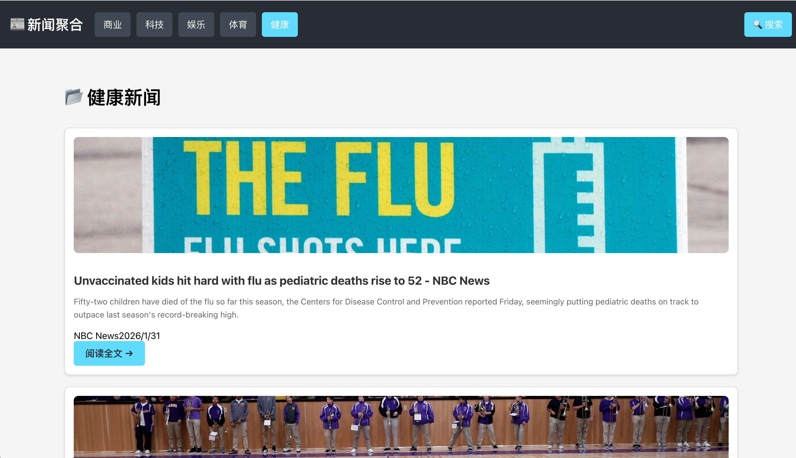
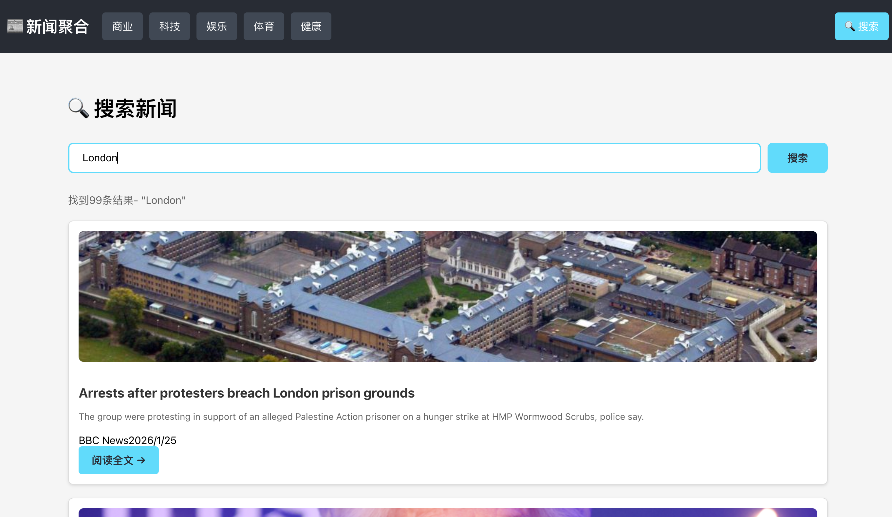
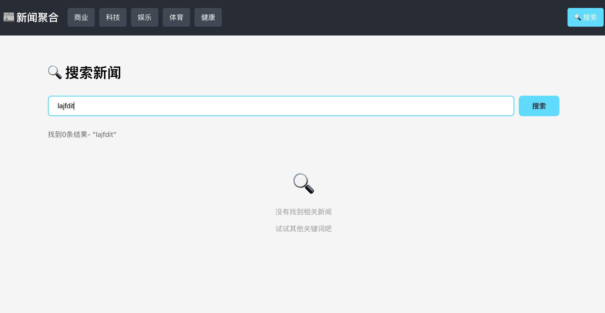

# 📰 News App (React)

## 📝 项目简介
一个基于 React + React Router 构建的实时新闻聚合平台。通过集成第三方 News API，实现了全球热点新闻的分类浏览、实时搜索及多页面路由管理，提供流畅的单页应用（SPA）阅读体验。

## ✨ 功能特性
- ✅ **动态路由导航**：利用 `react-router-dom` 实现了首页头条与多垂直分类（科技、商业、娱乐等）的无缝跳转。
- ✅ **全功能搜索系统**：支持自定义关键词检索，并提供搜索结果实时统计与友好的空状态反馈。
- ✅ **智能交互体验**：
    - **自动回顶**：路由切换时通过 `ScrollToTop` 组件实现自动平滑滚动至顶部。
    - **动态网页标题**：随当前页面功能通过 `updateTitle` 工具自动更新浏览器标签页标题。
- ✅ **优雅的加载状态**：内置自定义 Loading 动画，并在图片加载失败时自动展示 Placeholder 占位图。

## 🛠️ 技术栈
- **框架**: React (Hooks: `useState`, `useEffect`, `useParams`)
- **路由**: React Router v6
- **接口库**: 模块化封装的 `fetch` API 请求工具
- **样式**: 响应式 `Flexbox` 布局

## 📸 项目预览

### 1. 首页头条
展示最新全球热点新闻，支持快速获取当前最受关注的资讯列表。


### 2. 分类浏览
支持商业、科技、娱乐、体育、健康等五大垂直领域的精准分类切换。


### 3. 实时搜索反馈
支持基于关键词的全文检索，并实时展示搜索命中的结果总数。


### 4. 搜索空状态处理
针对无匹配结果的情况，提供直观的图形化提示与操作引导。



## 🚀 本地运行

### 1. 获取 API Key
由于新闻数据由第三方提供，运行前需获取个人 API Key：
* 访问 [NewsAPI.org](https://newsapi.org/) 注册账号。
* 在后台复制你的 `API Key`。
* 打开项目中的 `src/utils/api.js`，将 Key 粘贴至 `const API_KEY = "你的KEY";`。

### 2. 启动项目
```bash
# 安装依赖
npm install

# 启动开发服务器
npm start

# 启动后访问：
http://localhost:3000

```


## 💡 项目亮点
为了提升代码质量与用户体验，项目在开发过程中落实了以下技术细节：
* **安全性增强**：在所有外链跳转中配置 `rel="noopener noreferrer"`，有效防范 `window.opener` 被篡改的风险并保护用户隐私。
* **健壮的数据兼容性**：对 API 返回数据进行了严谨的合法性检查，并针对图片、来源及发布时间等缺失字段提供了完善的默认值或格式化处理。
* **URL 驱动的状态同步**：通过 RESTful 风格的 URL 参数驱动页面内容，确保了应用状态的可分享性与浏览器的前进后退兼容性。
* **工程化组件拆分**：将 UI 拆分为导航栏（Navbar）、新闻卡片（NewsCard）和加载器（Loading）等独立组件，实现了业务逻辑与视图展示的高效解耦。